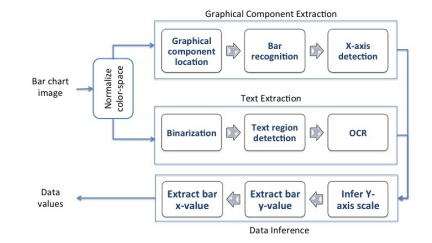

# 📊 Chart Digitizer

Extract data points from chart images using machine learning and computer vision.

[](https://github.com/rprabhat/chart-digitizer/stargazers)
[](LICENSE)

## 🎯 What It Does

Chart Digitizer extracts numerical data from chart images (bar charts, line charts, scatter plots) using:
- **Machine Learning** - CNN-based object detection for accurate data point identification
- **Computer Vision** - OpenCV and Tesseract OCR for legend and axis detection

## 🖥️ Demo



## 🚀 Quick Start

```bash
# Clone the repository
git clone https://github.com/rprabhat/chart-digitizer.git
cd chart-digitizer

# Run the Jupyter Notebook
jupyter notebook
```

## 📋 Requirements

- Python 3.x
- Jupyter Notebook
- OpenCV
- Tesseract OCR
- TensorFlow/PyTorch

## 📚 Documentation

See the Jupyter Notebook for:
- Random chart generator for training data
- CNN model training
- Data extraction pipeline

## 🔗 References

- [ChartSense (Microsoft Research)](https://www.microsoft.com/en-us/research/wp-content/uploads/2017/02/ChartSense-CHI2017.pdf)
- [WebPlotDigitizer](https://github.com/ankitrohatgi/WebPlotDigitizer)
- [Engauge Digitizer](https://github.com/markummitchell/engauge-digitizer)

## 📄 License

Apache License 2.0 - See [LICENSE](LICENSE)

## 👤 Author

**Prabhat Ranjan**
- GitHub: [@rprabhat](https://github.com/rprabhat)
- LinkedIn: [prabhatr](https://www.linkedin.com/in/prabhatr/)
- Substack: [prabhatranjan](https://prabhatranjan.substack.com)
